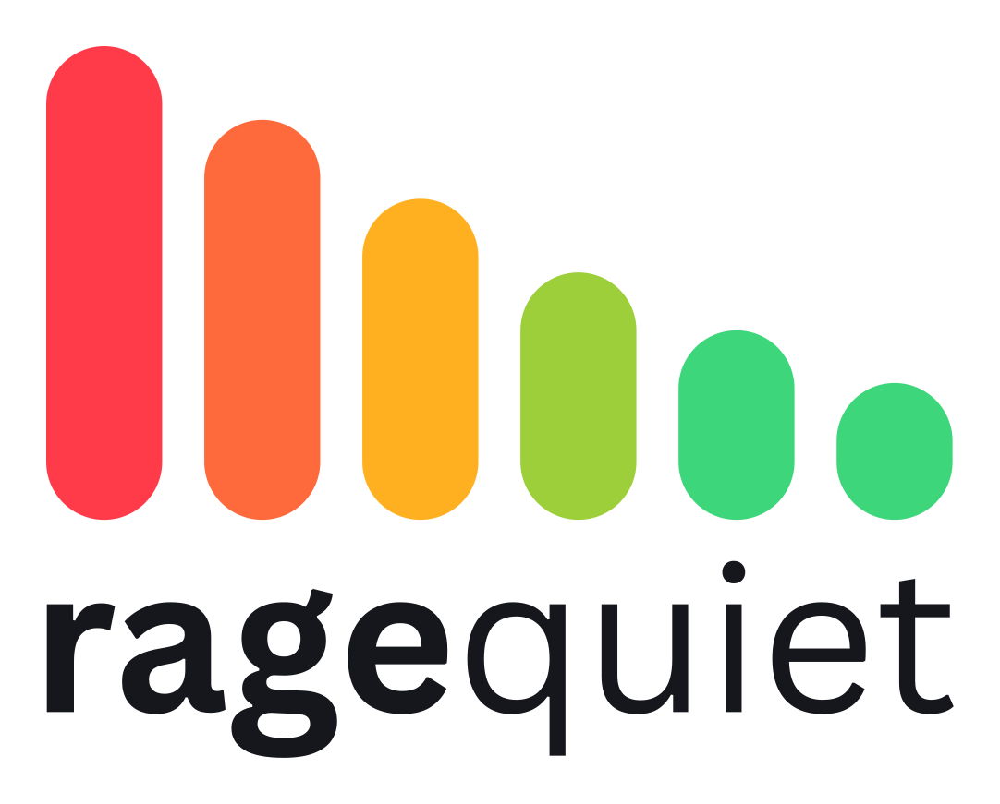

<picture>
  <source media="(prefers-color-scheme: dark)" srcset="assets/brand/logo-dark.svg">
  
</picture>

Beeps at you when you get too loud while gaming. Native Rust, sits in your tray, ~0% CPU, works no matter where your mic is.

## Why

Somebody's asleep in the next room and you keep forgetting how loud you get mid-game. Most "mic level" tools trigger on an absolute volume threshold, so they break the moment you move your headset, swap microphones, or sit closer to the desk. Ragequiet calibrates to *your* voice at *your* setup instead of a fixed number, and it keeps adapting so a change in gain or mic position doesn't mean recalibrating from scratch.

## Features

- Adaptive detection calibrated per microphone — works regardless of mic distance or gain
- Spectral analysis, so a raised voice doesn't get confused with a loud mechanical keyboard
- 3-step calibration wizard, about a minute, with the loud step skippable if it's late at night
- Tray icon shows current state at a glance (green/amber/red bars; a yellow dot means calibration is incomplete)
- 12 built-in alert sounds, or bring your own WAV/MP3
- Alerts play to a chosen output device, so you can route them to headphones instead of speakers
- Hold time and cooldown, so a single shout or a clap doesn't spam alerts
- Test mode to preview detection and alerts without waiting for a real trigger
- Sensitivity slider
- Optional start with Windows
- Single instance — launching it twice just focuses the existing tray icon

## Install

1. Grab the latest zip from [Releases](../../releases).
2. Unzip it anywhere.
3. Run `ragequiet.exe`.

> **First run will trip SmartScreen.** The exe isn't code-signed, so Windows will show "Windows protected your PC." Click **More info**, then **Run anyway**. This is a one-time prompt per download.

There's no installer — it's a single exe. No services, no background installer, nothing written outside your user profile.

## First run

The tray icon appears as soon as it starts. Right-click it and choose **Recalibrate** to run the setup wizard (about a minute). The wizard asks for a few seconds of quiet — your normal room/game background — and then a few seconds of you talking at a volume you'd consider "too loud." The loud step can be skipped late at night; ragequiet will fall back to a reasonable default until you calibrate it properly later.

## Performance

- 0% CPU when idle with no window open
- ~17 MB memory while sitting in the tray (opening the settings window adds roughly 5 MB while it's open)
- Single ~8.4 MB exe, no installer, no services
- No telemetry, no network access at all — audio never leaves the machine

<!-- screenshot: task manager showing 0% CPU -->

*(A short demo GIF is coming.)*

## Uninstall

1. If you turned on "Start with Windows," untick it first, or remove the `ragequiet` value under `HKCU\Software\Microsoft\Windows\CurrentVersion\Run`.
2. Delete `ragequiet.exe`.
3. Delete the `%APPDATA%\ragequiet\` folder.

That's everything — no registry entries, no leftover services.

## Building from source

Requires stable Rust on Windows.

```
cargo build --release
```

## License

MIT, see [LICENSE](LICENSE). Bundled alert sounds are either synthesized in code or CC0 recordings — see [sounds/LICENSES.md](sounds/LICENSES.md) for the breakdown.
